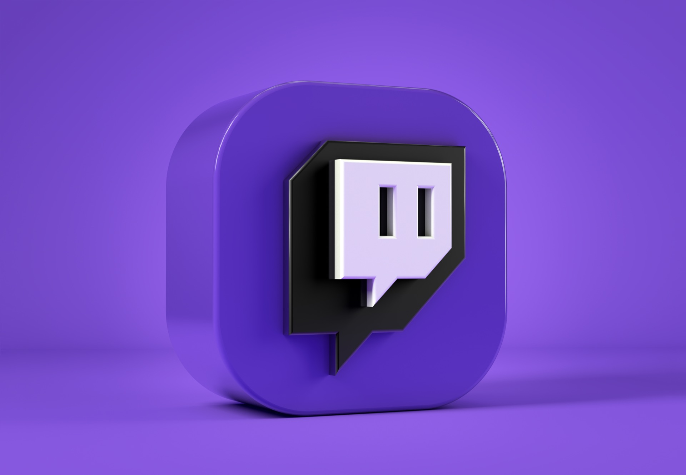
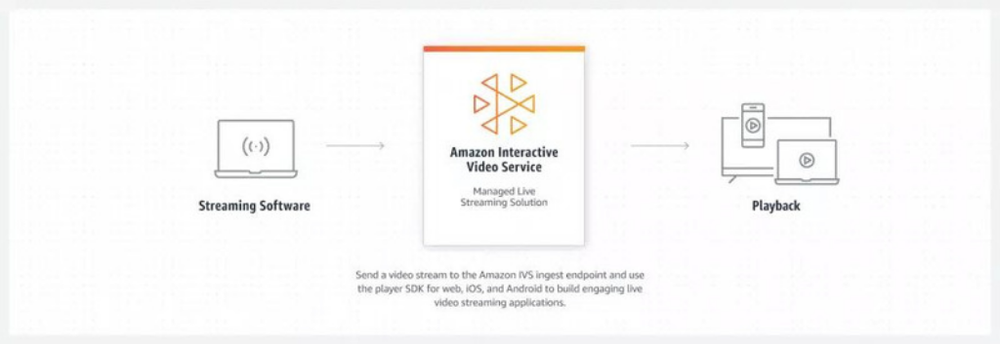
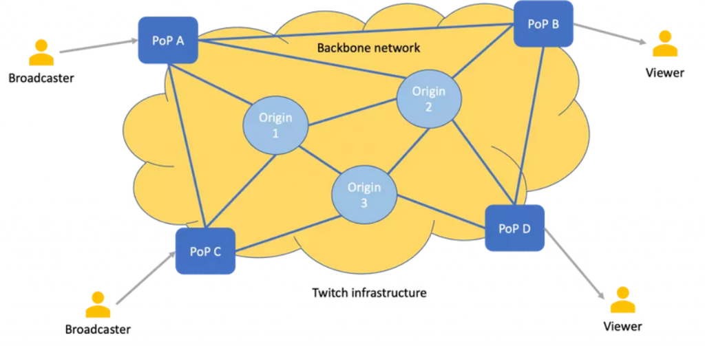
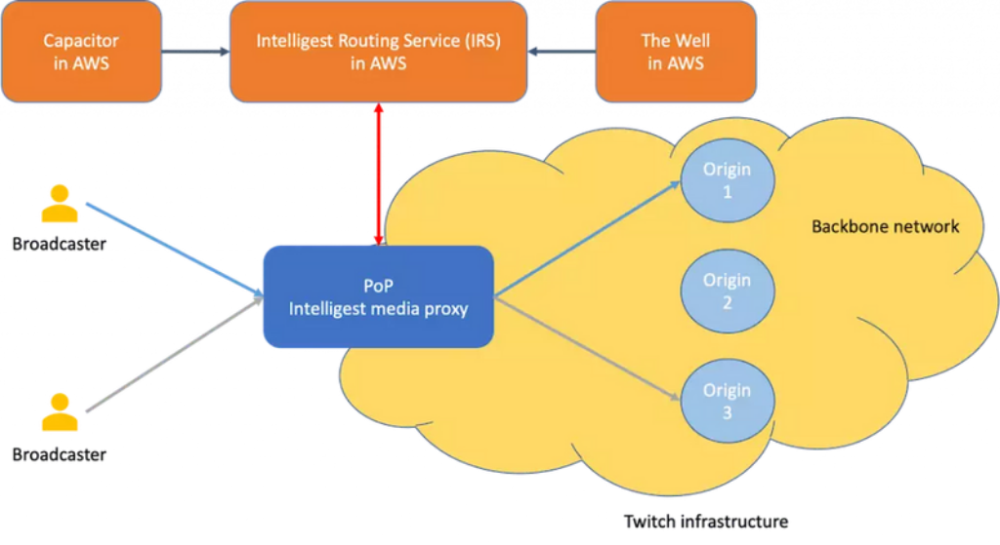

# Engenharia da Twitch: uma introdução e visão geral

Se você é um usuário do Twitch, provavelmente sabe que o Twitch é um site muito grande que transmite vídeo ao vivo, mas pode não ter ideia da escala e complexidade de todas as diferentes partes móveis necessárias para manter tudo junto.

Entre outras coisas, temos:

- Um dos maiores sistemas de distribuição de vídeo ao vivo do mundo

- Um sistema de chat em tempo real

- Serviços da Web que fornecem acesso a funcionalidades e dados

- Sistemas de armazenamento de dados

- Aplicativos cliente na Web e em várias plataformas — móveis e consoles em particular

- Infraestrutura de ciência de dados

- Ferramentas e sistemas internos — gerenciamento de configuração, sistemas de implantação, provisionamento de hardware e software, teste e controle de qualidade

- Infraestrutura de rede que mantém os bits entre todos esses sistemas e os usuários finais fluindo

Cada um desses diferentes componentes do Twitch tem diferentes desafios que precisam ser enfrentados - entre eles otimização de baixo nível de codificação de vídeo, dimensionamento de sistema em grande escala, implementação de produtos em várias plataformas e fatores de forma e melhoria de nossa eficiência de engenharia por meio de ferramentas aprimoradas.

## Engenharia em escala

Antes de mergulharmos na tecnologia que usamos atualmente, é importante observar que muitas das decisões que tomamos em relação à tecnologia são impulsionadas pelo tamanho do Twitch e pela rapidez com que ele está crescendo:

- Temos mais de 30.000 pessoas transmitindo vídeo no Twitch simultaneamente.

- Atingimos o pico de mais de 2 milhões de streams de vídeo simultâneos em nosso site.

- Nosso serviço de bate-papo entrega mais de 10 bilhões de mensagens por dia.

- Nossas APIs da web lidam com mais de 50 mil solicitações por segundo em média.

- Nos últimos 3 anos, o número de engenheiros na Twitch cresceu mais de 800%.

Isso significa que temos que escalar em nível de arquitetura e organizacional. À medida que cada sistema individual cresce, expomos diferentes tipos de modos de falha que não são problemas em sistemas menores, mas se tornam problemáticos à medida que os sistemas crescem.

## Nossa pilha de tecnologia (uma visão de 50 mil pés)

Há muito o que falar em profundidade aqui, mas tentarei uma visão geral de alto nível das principais peças de tecnologia que mantêm o Twitch funcionando.

## Sistema de vídeo

O sistema de vídeo é responsável por levar o vídeo da emissora para nossos espectadores. Isso inclui os seguintes componentes principais:

- Ingestão de vídeo — Pegamos o vídeo RTMP e o transportamos para o sistema de transcodificação.

- Sistema de transcodificação — Pegamos o fluxo RTMP de entrada do transmissor e o transcodificamos em vários fluxos HLS. Isso é implementado por meio de uma combinação de C/C++ e Go.

- Distribuição e borda — distribua os fluxos HLS para nossos POPs geograficamente díspares, de modo que você tenha a experiência de streaming de vídeo da mais alta qualidade. Novamente, principalmente escrito em Go.

- VOD (Video on Demand) — pegamos todos os nossos sistemas de vídeo recebidos e os arquivamos para o nosso sistema VOD.

## Chat

Chat is a highly scalable real-time distributed system written in Go. It delivers hundreds of billions of messages per day to users who are watching video via our own protocols, as well as supporting IRC as a communication protocol, making it easy for developers to create IRC bots to add their own custom chat features. Core chat components include:

- Edge — Receives and distribute messages between clients and backend services. Edge speaks the IRC protocol over both raw TCP and WebSockets.

- Pubsub — Distributes messages internally across Edge nodes. Pubsub and Edge combine to form a hierarchical message distribution system which executes massive fanout.

## APIs e dados da Web

Além dos nossos serviços em tempo real (vídeo e chat) dispomos também de um número substancial de serviços que incluem, mas não se limitam a:

- APIs da Web que permitem aos usuários gerenciar e personalizar seus perfis e assinaturas

- Serviços de pesquisa e descoberta que ajudam você a encontrar os fluxos que deseja.

- Sistemas de receita - são sistemas que nos permitem gerenciar publicidade e assinaturas e garantir que nossos parceiros recebam suas receitas.

- Ferramentas administrativas que ajudam nossa equipe de suporte a resolver seus problemas.

## Infraestrutura de ciência de dados

A Science Engineering constrói sistemas de coleta de dados e ferramentas de análise para estudar como nossos usuários interagem com nossos produtos. Esses sistemas incluem:

- O pipeline de dados, que coleta, limpa e carrega mais de um bilhão de eventos por dia em nosso data warehouse

- Agregadores de streaming para resumir as métricas quase em tempo real para as emissoras.

# Infraestrutura de transmissão de vídeo ao vivo no Twitch

A equipe de engenharia da Twitch criou uma solução de transmissão ao vivo escalável e de alta disponibilidade para permitir que os criadores de conteúdo em sua plataforma transmitam seus jogos com o mínimo de latência.

A solução de transmissão ao vivo (desenvolvida pela Twitch) também está disponível como um serviço para o mundo através do AWS IVS (Interactive Video Streaming), que permite que outras empresas que utilizam a AWS integrem serviços de transmissão interativa em seus aplicativos ou sites.

O AWS IVS é uma solução de transmissão ao vivo totalmente gerenciada que cuida da ingestão, transcodificação, empacotamento e entrega de conteúdo ao vivo para os espectadores finais.

Principais pontos da infraestrutura da Twitch:

Eles têm centenas de milhares de transmissores ao vivo simultâneos em sua plataforma. As transmissões possuem cinco níveis de qualidade diferentes para se adaptar às condições de rede dos espectadores.

A transmissão também possui um buffer de alguns segundos para baixar o vídeo no dispositivo do espectador antecipadamente, para que a transmissão seja executada sem problemas.

Ao longo dos anos, a Twitch conseguiu reduzir a latência da transmissão de 15 para 3 segundos. Em condições ideais de rede, por exemplo, na Coreia, a latência é reduzida para 1,5 segundos.

Por que a latência é importante em transmissões ao vivo? Não é possível que o vídeo seja armazenado em buffer e reproduzido como um vídeo comum?

Quanto menos tempo levar desde o momento em que um transmissor acena para a câmera até o momento em que seus espectadores veem esse aceno na tela, melhor é a experiência do usuário na plataforma. A redução da latência permite uma interação mais em tempo real entre os transmissores e os espectadores.

A Twitch estabeleceu parcerias com ISPs locais e possui vários PoPs alimentados por uma rede principal para garantir uma transmissão suave. Os espectadores baixam os vídeos dos PoPs, que são replicados em proximidade aos espectadores. A replicação é feita com base no alcance, levando em consideração a qualidade da conexão à internet dos espectadores. 

O processamento e distribuição das transmissões ocorrem nos data centers de origem. Inicialmente, a Twitch utilizava o HAProxy para rotear as transmissões, mas devido a desafios de eficiência e escalabilidade, desenvolveram o sistema de roteamento Intelligest, com componentes de proxy de mídia em cada PoP e o Serviço de Roteamento Intelligest (IRS) executado na AWS.

O proxy de mídia, com a ajuda do IRS, determina o data center de origem correto para enviar o tráfego, superando os desafios enfrentados com o HAProxy.

O IRS possui dois sub-serviços adicionais, o Capacitor e o Well. O Capacitor monitora os recursos computacionais disponíveis em cada data center de origem, enquanto o Well monitora a disponibilidade de largura de banda da rede principal. Com a ajuda desses serviços, o IRS pode determinar em tempo real a capacidade da infraestrutura. Isso permitiu que a Twitch alcançasse alta disponibilidade em sua infraestrutura.

# O monolito

A plataforma da Twitch foi criada oficialmente em 6 de Junho de 2011, sendo um monolito desenvolvido utilizando Ruby on Rails. Essa arquitetura funcionou bem durante um tempo, porém ela foi posteriormente repensada, por problemas de perfomance. O chat, por exemplo, apresentava um grande problema para a Twitch, já que os servidores não conseguiam manter a comunicação de chat com qualidade em dias que possuiam eventos de jogos na plataforma.

## A transição para microsserviços

A ideia da nova arquitetura da Twitch era substituir o monolito por uma arquitetura baseada em microsserviços. Inicialmente, o foco era transformar o chat das lives em um microsserviço. Dentre as várias tecnologias estudadas para realizar essa mudança, Go foi a escolhida. Após testarem o chat e obterem bons resultados, outros times da Twitch tentaram utilizar o Go para outros serviços.

A linguagem foi experimentada, por exemplo, para listar as maiores livestreams para cada categoria na Twitch. Essa tecnologia foi apelidada de Jax, e apresentou uma série de desafios para seu desenvolvimento, como indexar dados em tempo real, tentando manter eles organizados.

# O monolito - Parte 2

## A migração em massa: Wexit

Em 2015, o Twitch iniciou uma campanha chamada "Wexit" para migrar seu código de back-end para microsserviços Go. A maioria do site ainda estava funcionando dentro de um monólito Rails, o que apresentava vários desafios para os desenvolvedores. Diversos esforços foram feitos para melhorar a situação, incluindo desacoplar o código dentro do monolito e adicionar um proxy reverso NGINX para redirecionar o tráfego para uma nova borda da API escrita em Go.

O processo de migração consistiu em desenvolver o novo microsserviço, replicar o endpoint antigo na nova borda, atualizar a configuração do NGINX para redirecionar parte do tráfego para o novo endpoint e, gradualmente, aumentar o tráfego até atingir 100%. Essa abordagem permitiu que as equipes desenvolvessem novas funcionalidades, tornando o monolito obsoleto ao longo do tempo.

Durante a campanha, os desenvolvedores tiveram que lidar com uma mudança significativa na cadeia de ferramentas, escrevendo código em vários repositórios com ciclos de implantação diferentes. Eles também tiveram que aprender a provisionar recursos na nuvem (AWS) usando a linguagem de programação Go. Chamadas para módulos dentro do monolito eram simples, mas chamar outros serviços exigia considerações adicionais, como tratamento de erros, monitoramento, limitação de taxa, segurança, testes de integração e muito mais.

Apesar do caos inicial, algumas estruturas úteis surgiram como resultado desse processo. Alguns desses frameworks se tornaram populares dentro da empresa e também projetos de código aberto, como o Twirp.

## Impacto Organizacional

O crescimento rápido de empresas como a Twitch requer mudanças rápidas na estrutura organizacional, o que adiciona dificuldades às migrações em andamento. A estrutura de comunicação das organizações tende a refletir em seus serviços, o que pode resultar em pontos cegos se os desenvolvedores se concentrarem apenas em suas áreas de responsabilidade.

Um exemplo disso ocorreu em 2017, quando uma nova versão do aplicativo móvel Twitch causou uma sobrecarga nos servidores da API. O problema foi causado por um novo comportamento de repetição no aplicativo móvel que resultou em uma grande quantidade de solicitações à API. As equipes responsáveis pelo aplicativo móvel e pela API realizaram testes, mas ninguém estava encarregado de verificar se as duas partes funcionavam bem juntas.

## A Cauda Longa

Durante a migração do Twitch, a regra de Pareto foi aplicada, onde os últimos 20% do trabalho exigiram 80% do tempo. Os endpoints mais difíceis de migrar foram deixados para o final. Para lidar com isso, um grupo interno foi formado para monitorar e migrar esses últimos serviços.

Alguns dos endpoints restantes ainda recebiam tráfego de fontes desconhecidas, como bots ou scripts, e não era claro qual era a função desses endpoints. A única maneira de determinar se era seguro desativá-los era forçar 10 minutos de inatividade e verificar se alguém relatava problemas.

No final de 2018, todo o tráfego foi removido do monólito e todas as instâncias do EC2 na conta principal da AWS puderam ser encerradas. No entanto, ainda era necessário mais um ano para limpar completamente a conta de dependências e funções de acesso, o que foi feito por meio de auditorias de segurança e atualizações tecnológicas em toda a empresa. Para todos os efeitos, a campanha "Wexit" foi concluída. Houve uma celebração com troféus para todos do grupo de trabalho e uma festa para comemorar o sucesso da migração.

## Microsserviços Hoje

Atualmente, no Twitch, a maioria das equipes trabalha com vários microsserviços. A linguagem preferida para o código do servidor é o Go, embora outras linguagens, como TypeScript, Python, C++, Java/Kotlin e ObjectiveC/Swift, também sejam usadas em outras plataformas. Cada serviço é isolado em uma conta separada da AWS, seguindo o padrão chamado de "Tiny Bubbles".

As equipes de produtos operam de forma independente, gerenciando sua própria infraestrutura e ajustando seus serviços conforme necessário. Equipes centrais fornecem estruturas e ferramentas específicas para padronizar a pilha de engenharia e as práticas operacionais. Embora ainda ocorram migrações de código à medida que novas tecnologias se tornam disponíveis, a natureza distribuída dos microsserviços permite que as equipes contribuam em escala.

# Fontes

- https://blog.twitch.tv/en/2015/12/18/twitch-engineering-an-introduction-and-overview-a23917b71a25/

- https://scaleyourapp.com/live-video-streaming-infrastructure-at-twitch/

- https://blog.twitch.tv/en/2022/03/30/breaking-the-monolith-at-twitch/

- https://blog.twitch.tv/en/2022/04/12/breaking-the-monolith-at-twitch-part-2/

